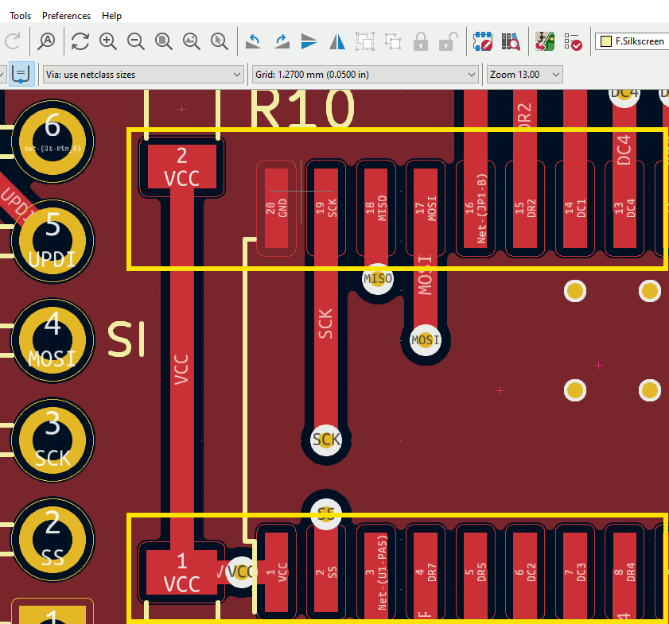

  

# KiCAD Pads2Rectangle

Plugin to change all pads in a layout (PCB) to rectangle pads. Sometimes this is necessary for older software (e.g. Martin CAM-Designer).

# Download and install latest version:

[Download](https://github.com/sunriax/pads2rectangle/releases/latest/download/pads2rectangle.zip) current release.

---

R. GÄCHTER